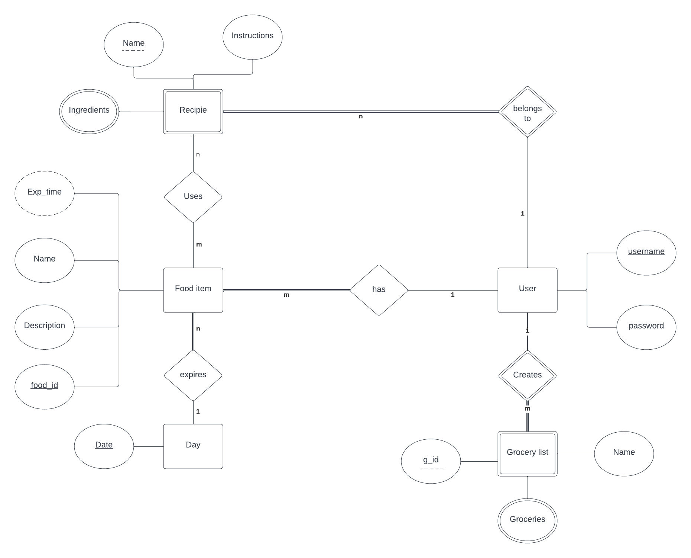
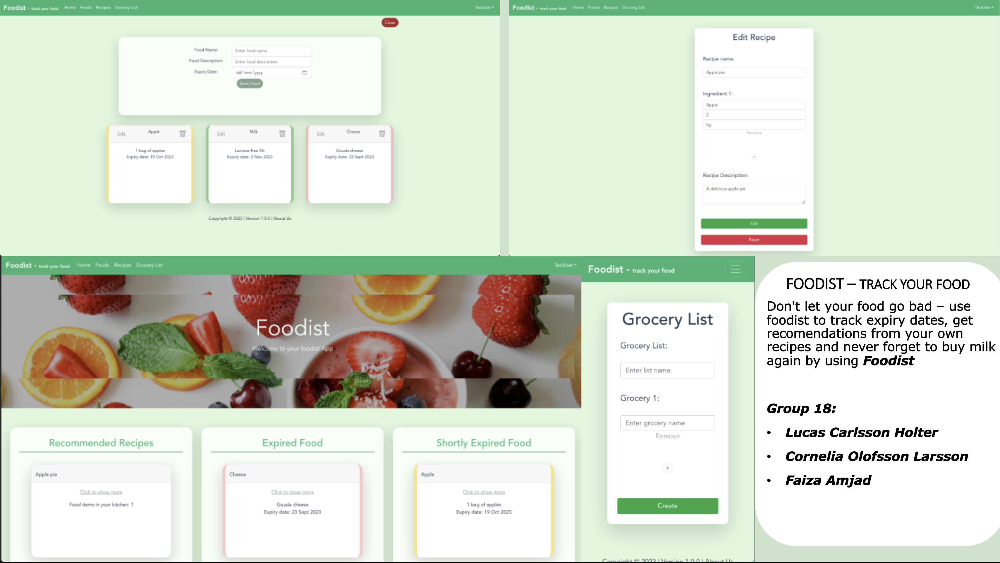

# Backend and Frontend Template

Latest version: https://git.chalmers.se/courses/dit342/group-00-web

This template refers to itself as `group-00-web`. In your project, use your group number in place of `00`.

## Project Structure

| File        | Purpose           | What you do?  |
| ------------- | ------------- | ----- |
| `server/` | Backend server code | All your server code |
| [server/README.md](server/README.md) | Everything about the server | **READ ME** carefully! |
| `client/` | Frontend client code | All your client code |
| [client/README.md](client/README.md) | Everything about the client | **READ ME** carefully! |
| [docs/DEPLOYMENT.md](docs/DEPLOYMENT.md) | Free online production deployment | Deploy your app online in production mode |
| [docs/LOCAL_DEPLOYMENT.md](docs/LOCAL_DEPLOYMENT.md) | Local production deployment | Deploy your app local in production mode |

## Requirements

The version numbers in brackets indicate the tested versions but feel free to use more recent versions.
You can also use alternative tools if you know how to configure them (e.g., Firefox instead of Chrome).

* [Git](https://git-scm.com/) (v2) => [installation instructions](https://www.atlassian.com/git/tutorials/install-git)
  * [Add your Git username and set your email](https://docs.gitlab.com/ce/gitlab-basics/start-using-git.html#add-your-git-username-and-set-your-email)
    * `git config --global user.name "YOUR_USERNAME"` => check `git config --global user.name`
    * `git config --global user.email "email@example.com"` => check `git config --global user.email`
  * > **Windows users**: We recommend to use the [Git Bash](https://www.atlassian.com/git/tutorials/git-bash) shell from your Git installation or the Bash shell from the [Windows Subsystem for Linux](https://docs.microsoft.com/en-us/windows/wsl/install-win10) to run all shell commands for this project.
* [Chalmers GitLab](https://git.chalmers.se/) => Login with your **Chalmers CID** choosing "Sign in with" **Chalmers Login**. (contact [support@chalmers.se](mailto:support@chalmers.se) if you don't have one)
  * DIT342 course group: https://git.chalmers.se/courses/dit342
  * [Setup SSH key with Gitlab](https://docs.gitlab.com/ee/ssh/)
    * Create an SSH key pair `ssh-keygen -t ed25519 -C "email@example.com"` (skip if you already have one)
    * Add your public SSH key to your Gitlab profile under https://git.chalmers.se/profile/keys
    * Make sure the email you use to commit is registered under https://git.chalmers.se/profile/emails
  * Checkout the [Backend-Frontend](https://git.chalmers.se/courses/dit342/group-00-web) template `git clone git@git.chalmers.se:courses/dit342/group-00-web.git`
* [Server Requirements](./server/README.md#Requirements)
* [Client Requirements](./client/README.md#Requirements)

## Getting started

```bash
# Clone repository
git clone git@git.chalmers.se:courses/dit342/group-00-web.git

# Change into the directory
cd group-00-web

# Setup backend
cd server && npm install
npm run dev

# Setup frontend
cd client && npm install
npm run serve
```

> Check out the detailed instructions for [backend](./server/README.md) and [frontend](./client/README.md).

## Visual Studio Code (VSCode)

Open the `server` and `client` in separate VSCode workspaces or open the combined [backend-frontend.code-workspace](./backend-frontend.code-workspace). Otherwise, workspace-specific settings don't work properly.

## System Definition (MS0)

### Purpose

The purpose of the system is to help the user monitor the groceries and other food staples currently in their kitchen. After the user catalogs the products and assigns expiration dates to each staple, the system can notify the user when the expiration date approaches, which reduces food waste. Apart from notifying the user, the system will also take favorite recipes as input, and recommend recipes with regard to what the user has in their kitchen. Another feature is to act as an easily accessible and manageable grocery list, where the user writes their own grocery list whilst also getting recommendations on staples that will soon expire. The goal of the system is to reduce food waste and contribute to a sustainable food economy. 

### Pages

Here are the pages of the system.
* Home page: User's login page. 
* Account page: (For the first users only) User will enter name, password and add a food list with the name and the expiry date.
* Foodstuff: (When logged in) User will see a list of food items that are expiring soon and can add more food items with their expiry dates.
* Receipe Katalog: User will have a list of receipes recommended in regards to the short term expiring items and can also add their favorite recepies.
* Receipe: User will see the ingredients and follow the instructions direct from the system.
* Grocery List: User can make a grocery list with the help of recommendations of the expiring products from the system .

### Entity-Relationship (ER) Diagram



## Teaser (MS3)


